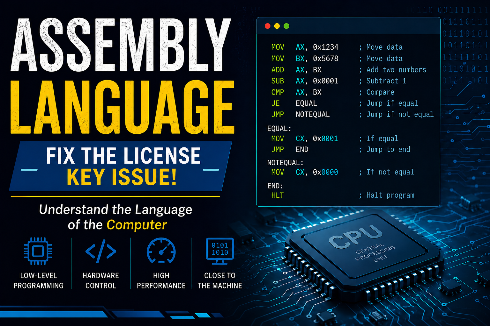

# EMU8086 License Key Activation Guide

## Overview

EMU8086 is an emulator and IDE for learning and programming Intel 8086 assembly language. It comes with a **30-day free trial**. After the trial period expires, you need to enter a **License Key** to continue using the software.

---

## What is a License Key?

A **License Key** is a unique alphanumeric code (20-25 characters) that:
- Allows permanent use of EMU8086 on your computer
- Is bound to your email address and computer
- Is provided via email after purchase
- Removes the trial limitation

---

## Your License Key Information

| Details | Your Information |
|---------|-------------|
| **User** | ISHAAN |
| **License Key** | 27R3VDEFYFX4N0VC3FRTQZX |
| **Status** | Active/Ready to Activate |
| **Type** | Full License |
| **Duration** | Permanent (No expiration) |

**⚠️ IMPORTANT**: Keep this license key secure. Do not share it with anyone else.

---
---

## Activating Your License Key - Step by Step

### Step 1: Open EMU8086
- Launch the EMU8086 application
- You may see a message like:
  ```
  Trial version - Days remaining: X
  Enter License Key
  ```

### Step 2: Navigate to License Menu
Choose one of these options:
```
Menu → Help → License
```
OR
```
Menu → File → License Information
```
OR
Look for a **"License Key"** or **"Register"** button in the main window

### Step 3: Enter Your License Information
1. Click on **"Enter License Key"** or **"Register Now"**
2. A dialog box will appear asking for:
   - **License Key** (the code I provide in Upper of this file and lower place)
3. Carefully paste or type your license key (avoid extra spaces)
4. Click **"OK"**, **"Activate"**, or **"Register"** button

### Step 4: Verification
If everything is correct:
- ✅ You'll see: "License activated successfully" or "Registration complete"
- ✅ The trial countdown will disappear
- ✅ You can use EMU8086 indefinitely

### Step 5: Verify Activation
1. Restart EMU8086
2. Check the title bar or Help menu
3. It should show: "EMU8086 (Licensed)" or your registered name

---


## License Key Best Practices

### Keeping Your License Safe

✅ **DO:**
- Save your license key in a secure location
- Keep the email confirmation from purchase
- Back up your registration information
- Use the same email for all purchases from this vendor

❌ **DON'T:**
- Share your license key with others
- Post it on public forums or websites
- Store it in unsecured cloud services
- Give it to anyone unless authorized
---

## Important Information

| Topic | Details |
|-------|---------|
| **License Validity** | Permanent (no renewal needed) |
| **Multiple Computers** | Need separate licenses for each computer |
| **Portable Version** | Can usually use same license on portable/USB version |
| **Version Upgrades** | Major versions may require new license |
| **Refund Policy** | Check www.emu8086.com for specific policy |
| **Support Duration** | Contact support@emu8086.com for assistance |

---

## Getting Help

If you need further assistance:

| Resource | Contact |
|----------|---------|
| **Official Website** | www.emu8086.com |
| **Support Email** | support@emu8086.com |
| **FAQ** | Visit website FAQ section |
| **Manual** | Included in EMU8086 installation |
| **Forum/Community** | Check website for community links |

---

## License Key Format - Your Key

Your license key: use this Then your emulator working start

```
User: ISHAAN
License Key: 27R3VDEFYFX4N0VC3FRTQZX
```

**Important Notes:**
- The license key is case-sensitive
- Do not add or remove any characters
- Do not modify spaces or hyphens
- Copy the exact key as shown above
- If entering manually, type carefully without extra spaces

---

## Document Information

- **Written by**: Nimra Asif
- **Language**: English

---

## Disclaimer

This guide is provided for informational purposes. For official information, always refer to www.emu8086.com. Pricing, features, and processes may change. Contact the official support team for the most current information.

---

**Happy Assembly Programming! **

For any questions or issues, don't hesitate to contact the official EMU8086 support team.
