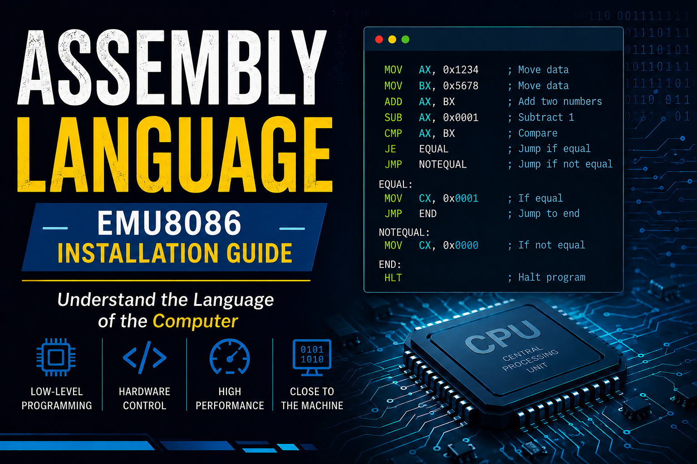

# EMU8086 Installation Guide

EMU8086 is an emulator and IDE for learning/programming Intel 8086 assembly language. Here's how to install it:

## **Windows Installation**

### Option 1: Direct Download & Install
1. Visit the official website: **www.emu8086.com**
2. Click **"Download"** to get the installer
3. Run the `.exe` installer file
4. Follow the installation wizard:
   - Accept the license agreement
   - Choose installation directory (default: `C:\Program Files\emu8086`)
   - Complete the setup
5. Launch from **Start Menu** or desktop shortcut

### Option 2: Portable Version
1. Download the portable ZIP version from the website
2. Extract to any folder
3. Run `emu8086.exe` directly (no installation needed)

## **System Requirements**
- **OS**: Windows XP, Vista, 7, 8, 10, 11
- **RAM**: 512 MB minimum
- **Storage**: ~50 MB free space
- **Administrator rights** (recommended for full functionality)

## **Initial Setup After Installation**

1. **Launch the application**
2. Go to **File → New** to create an assembly program
3. Start writing 8086 assembly code
4. **Assemble** (Ctrl+F5) to compile
5. **Run** (F5) to execute in the emulator

## **Getting Started with a Sample Program**

Create a simple program to verify installation:
```asm
.model small
.stack 100h
.data
.code
main proc

mov ax, 5
mov bx, 3
add ax, bx

mov ah, 4ch
int 21h
main endp
end main
```

## **Troubleshooting**

| Issue | Solution |
|-------|----------|
| Won't start | Run as Administrator |
| Missing DLLs | Reinstall the application |
| Can't assemble | Check syntax; use the built-in assembler |


## **Written by*
### **Nimra asif*

