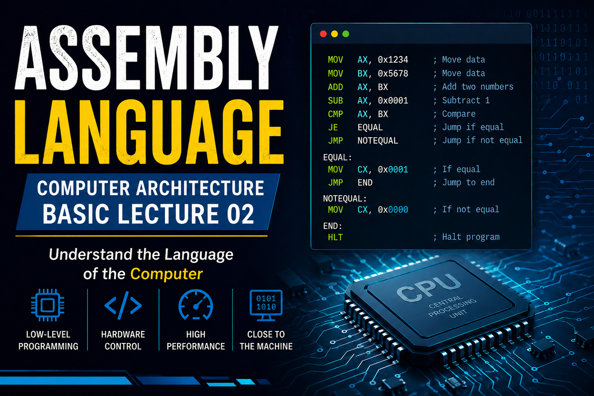

# Module 2: Computer Architecture Basics

##  Course Overview
This module covers the fundamental concepts of computer architecture, focusing on how processors work at the hardware level. Students will understand CPU design, memory organization, and how components communicate through buses.

---

##  Table of Contents
1. [CPU Architecture](#cpu-architecture)
2. [Registers](#registers)
3. [Memory Organization](#memory-organization)
4. [Data Bus, Address Bus, and Control Bus](#buses)
5. [Practical Examples](#practical-examples)
6. [Summary](#summary)

---

## CPU Architecture

### What is a CPU?
The **CPU (Central Processing Unit)** is the brain of the computer. It:
- Executes instructions from memory
- Processes and manipulates data
- Controls all other components of the system

### Basic CPU Structure

```
┌─────────────────────────────────────────┐
│          CPU Architecture               │
├─────────────────────────────────────────┤
│  ┌──────────────┐  ┌──────────────┐    │
│  │  Control     │  │   ALU        │    │
│  │  Unit        │  │ (Arithmetic  │    │
│  │  (CU)        │  │  Logic Unit) │    │
│  └──────────────┘  └──────────────┘    │
│         │                  │             │
│  ┌──────────────────────────────────┐  │
│  │      Registers (Fast Memory)     │  │
│  ├──────────────────────────────────┤  │
│  │ EAX, EBX, ECX, EDX, ESP, etc.   │  │
│  └──────────────────────────────────┘  │
│         │                               │
│  ┌──────────────────────────────────┐  │
│  │  Buses (Data, Address, Control)  │  │
│  └──────────────────────────────────┘  │
└─────────────────────────────────────────┘
```

### Key CPU Components

| Component | Function |
|-----------|----------|
| **Control Unit (CU)** | Decodes instructions and controls the execution flow |
| **ALU** | Performs arithmetic (+, -, *, /) and logical (AND, OR, NOT) operations |
| **Registers** | Ultra-fast temporary storage within the CPU |
| **Cache** | High-speed memory located close to the CPU (L1, L2, L3) |

### CPU Execution Cycle
The CPU follows a **Fetch-Decode-Execute** cycle:

```
1. FETCH   → Retrieve instruction from memory
           ↓
2. DECODE  → Interpret the instruction
           ↓
3. EXECUTE → Perform the operation
           ↓
4. STORE   → Save the result back to memory/register
```

---

## Registers

### What are Registers?
**Registers** are the fastest storage locations in the CPU. They hold data that the CPU is actively working on. Modern CPUs have different register sizes:

- **8-bit**: AL, BL, CL, DL (parts of larger registers)
- **16-bit**: AX, BX, CX, DX, SI, DI, BP, SP
- **32-bit**: EAX, EBX, ECX, EDX, ESI, EDI, EBP, ESP
- **64-bit**: RAX, RBX, RCX, RDX, RSI, RDI, RBP, RSP

### 8086 General Purpose Registers (16-bit)

```
8086 Register Architecture:

┌─────────────────────────────────────────┐
│         16-bit Registers (8086)         │
├─────────────────────────────────────────┤
│  AX (Accumulator)      BX (Base)       │
│  CX (Counter)          DX (Data)       │
│  SI (Source Index)     DI (Dest Index) │
│  BP (Base Pointer)     SP (Stack Ptr)  │
│                                        │
│  HighByte  LowByte                    │
│  AH        AL    (AX = AH:AL)         │
│  BH        BL    (BX = BH:BL)         │
│  CH        CL    (CX = CH:CL)         │
│  DH        DL    (DX = DH:DL)         │
└─────────────────────────────────────────┘
```

### 8086 Register Details and Purpose

| Register | Purpose | Common Use |
|----------|---------|-----------|
| **AX** | Accumulator (16-bit) | AL (8-bit low), AH (8-bit high) - Main calculations |
| **BX** | Base Register (16-bit) | Used as base address for addressing |
| **CX** | Counter Register (16-bit) | CL for shift/rotate, loop counters |
| **DX** | Data Register (16-bit) | I/O operations, used with AX for 32-bit divide |
| **SI** | Source Index (16-bit) | String operations, source pointer |
| **DI** | Destination Index (16-bit) | String operations, destination pointer |
| **BP** | Base Pointer (16-bit) | Stack frame management, local variables |
| **SP** | Stack Pointer (16-bit) | Points to top of stack |

### Special Purpose Registers

#### Instruction Pointer (IP)
```
Contains the memory address of the next instruction to execute
(In 8086, this is 16-bit, combined with CS for actual address)
```

#### Flags Register (FLAGS)
```
Stores status flags from the last operation:

Zero Flag (ZF)      → Set if result is zero
Carry Flag (CF)     → Set if overflow occurred
Sign Flag (SF)      → Set if result is negative
Overflow Flag (OF)  → Set if signed overflow
Parity Flag (PF)    → Set if even number of 1-bits
Auxiliary Flag(AF)  → Set on half-carry (BCD operations)
Direction Flag(DF)  → Controls string operation direction
Interrupt Flag(IF)  → Enables/disables interrupts
Trap Flag(TF)       → Single-step mode for debugging
```

#### Segment Registers (8086 Specific)

8086 uses **Real Mode Memory Segmentation**. Each segment is 64KB and addressed using segment registers.

```
┌──────────────────────────────────────────────┐
│      8086 Segment Registers (16-bit)        │
├──────────────────────────────────────────────┤
│ CS (Code Segment)   - Points to code        │
│ DS (Data Segment)   - Points to data        │
│ ES (Extra Segment)  - Additional data seg   │
│ SS (Stack Segment)  - Points to stack       │
└──────────────────────────────────────────────┘
```

### Memory Addressing in 8086 (Real Mode)

8086 uses **Segment:Offset** addressing to access 1 MB of memory:

```
Physical Address = (Segment × 16) + Offset

Example:
Segment = 0x1000 (CS)
Offset  = 0x0100 (IP)

Physical Address = (0x1000 × 16) + 0x0100
                 = 0x10000 + 0x0100
                 = 0x10100
```

Each segment provides 64KB (0x0000 to 0xFFFF) of addressable memory:

```
CS:IP  → Code location
DS:BX  → Data location
SS:SP  → Stack location
ES:DI  → Extra data location
```

### Assembly Examples with 8086 Registers

```asm
; Example 1: Basic arithmetic with 8086
mov ax, 10          ; Move 10 into AX (16-bit)
mov bx, 5           ; Move 5 into BX (16-bit)
add ax, bx          ; AX = AX + BX (result: 15)

; Example 2: Working with high/low bytes
mov ax, 0x1234      ; AX = 0x1234
mov al, [0x500]     ; Load byte into AL (lower byte)
mov ah, [0x501]     ; Load byte into AH (upper byte)
; Now AX contains 2-byte value

; Example 3: 8-bit arithmetic
mov al, 25          ; AL = 25
mov bl, 15          ; BL = 15
add al, bl          ; AL = AL + BL (40)

; Example 4: Loop with CX (Counter Register)
mov cx, 5           ; Set loop counter to 5
loop_start:
    ; do something
    loop loop_start  ; Decrement CX, jump if not zero

; Example 5: Working with memory addresses in 8086
mov bx, offset array    ; Load array offset into BX
mov al, [bx]           ; Load first byte of array
mov ah, [bx + 1]       ; Load second byte
add al, ah             ; Add them
```

---

## Memory Organization (8086 Real Mode)

### 8086 Memory Model (Real Mode)

The 8086 microprocessor uses **Real Mode** addressing with **memory segmentation**:

```
┌──────────────────────────────────────────────┐
│   8086 Real Mode Memory (1 MB Total)        │
├──────────────────────────────────────────────┤
│         0xFFFFF (1,048,575)                 │
│                                             │
│  ┌────────────────────────────────────┐    │
│  │  CS (Code Segment) - 64KB max      │    │
│  │  Contains program instructions     │    │
│  │  Addressed as CS:IP                │    │
│  └────────────────────────────────────┘    │
│                                             │
│  ┌────────────────────────────────────┐    │
│  │  DS (Data Segment) - 64KB max      │    │
│  │  Contains global/static data       │    │
│  │  Addressed as DS:offset            │    │
│  └────────────────────────────────────┘    │
│                                             │
│  ┌────────────────────────────────────┐    │
│  │  ES (Extra Segment) - 64KB max     │    │
│  │  Additional data storage           │    │
│  │  Addressed as ES:offset            │    │
│  └────────────────────────────────────┘    │
│                                             │
│  ┌────────────────────────────────────┐    │
│  │  SS (Stack Segment) - 64KB max     │    │
│  │  Contains stack                    │    │
│  │  Addressed as SS:SP                │    │
│  └────────────────────────────────────┘    │
│                                             │
│         0x00000 (0)                        │
└──────────────────────────────────────────────┘

Formula: Physical Address = (Segment × 16) + Offset
```

### 8086 Memory Segments in Detail

#### 1. Code Segment (CS) - .code
Contains executable instructions.

```asm
assume cs:code, ds:data, ss:stack

code segment
    org 100h            ; Origin at 100h (COM program format)
    
    start:
        mov ax, 0x1234
        add ax, bx
        
        ; Exit to DOS
        mov ah, 4Ch     ; DOS exit function
        int 21h         ; DOS interrupt
        
code ends
```

#### 2. Data Segment (DS) - .data
Contains initialized global variables.

```asm
data segment
    counter dw 0        ; 2-byte word, initialized to 0
    message db "Hello, World!", 0x0D, 0x0A, '$'
    pi dw 314           ; Integer representation of 3.14
    myArray db 10, 20, 30, 40, 50
    
data ends
```

#### 3. Stack Segment (SS)
Used for stack operations, return addresses, and local variables.

```asm
stack segment stack
    dw 100 dup(?)       ; Reserve 200 bytes (100 words) for stack
    
stack ends
```

#### 4. Extra Segment (ES)
Additional data segment, often used for string operations.

```asm
; Used with string instructions
; mov ax, seg destination
; mov es, ax
; Use with DI (Destination Index) for string ops
```

### 8086 Program Structure Example

```asm
; Complete 8086 program structure

stack segment stack
    dw 64 dup(?)        ; 128 bytes stack space
stack ends

data segment
    counter dw 5
    values db 10, 20, 30, 40, 50
    result dw 0
data ends

code segment
    assume cs:code, ds:data, ss:stack
    
    start:
        ; Initialize data segment
        mov ax, data
        mov ds, ax
        
        ; Initialize stack segment
        mov ax, stack
        mov ss, ax
        mov sp, 128     ; Stack pointer to top
        
        ; Your program code here
        mov ax, [counter]
        add ax, 5
        mov [result], ax
        
        ; Exit to DOS
        mov ax, 4C00h   ; DOS exit (code 0)
        int 21h
        
code ends

end start            ; Specify entry point
```

### 8086 Memory Addressing Modes

```asm
; 1. Direct Addressing
mov ax, [0x500]             ; Access memory at offset 0x500 in DS

; 2. Register Indirect
mov bx, offset myArray      ; BX holds array offset
mov al, [bx]                ; Access first element

; 3. Indexed Addressing
mov ax, [bx + 4]            ; Access element at offset+4

; 4. Based Indexed Addressing
mov al, [bx + si]           ; Combination of base and index
mov al, [bp + di + 2]       ; With constant offset

; 5. Segment Override
mov ax, [es:bx]             ; Use ES segment instead of DS
mov ax, [ss:bp]             ; Use SS segment
```

---

## Buses

The **Bus** is a communication pathway that connects CPU, Memory, and I/O devices. There are three main types:

### 1. Data Bus (Data Transfer)

**Purpose**: Transfer actual data between CPU and Memory/IO devices

**Characteristics**:
- **Width**: Determines how much data can be transferred simultaneously
  - 8-bit bus: 1 byte per cycle
  - 16-bit bus: 2 bytes per cycle
  - 32-bit bus: 4 bytes per cycle
  - 64-bit bus: 8 bytes per cycle
- **Bidirectional**: Data flows both directions (read/write)

```
CPU ← → Memory
  ↑
  └─ Data Bus (32 or 64 wires)
```

**Assembly Example (8086)**:
```asm
mov ax, [0x500]         ; Read 2 bytes from offset 0x500 in DS
                        ; Data Bus transfers data to AX

mov [0x500], bx        ; Write 2 bytes from BX to offset 0x500
                        ; Data Bus transfers data from CPU to Memory
                        
; With segment override:
mov ax, es:[0x500]     ; Read from ES segment
mov es:[0x500], ax     ; Write to ES segment
```

### 2. Address Bus (Location Selection)

**Purpose**: Specify which memory location to access

**Characteristics** (8086):
- **20-bit address bus**: Can address 2^20 = 1 MB of memory
- **Segment:Offset model**: 
  - Segment (16-bit): CS, DS, ES, SS
  - Offset (16-bit): Address within segment
  - Physical Address = (Segment × 16) + Offset

```
8086 Address Bus can access:
Addresses from 0x00000 to 0xFFFFF (1,048,576 bytes)

Example Memory Locations:
- 0x00000 to 0x0FFFF: First 64KB
- 0x10000 to 0x1FFFF: Second 64KB
- ...
- 0xF0000 to 0xFFFFF: Last 64KB
```

**8086 Addressing Example**:
```asm
mov ax, [0x500]         ; Address bus carries offset 0x500 in DS
mov bx, [0xFFFF]        ; Address bus carries offset 0xFFFF

; Segment override changes address bus routing:
mov ax, es:[0x500]      ; Use ES segment instead of DS
mov ax, ss:[0x500]      ; Use SS segment
mov ax, cs:[0x500]      ; Use CS segment
```

### 3. Control Bus (Signals and Commands)

**Purpose**: Carry control signals to coordinate and manage data transfers

**Control Signals**:

| Signal | Function | Active When |
|--------|----------|------------|
| **Read (RD)** | Instruct memory to output data | Reading from memory |
| **Write (WR)** | Instruct memory to store data | Writing to memory |
| **Clock (CLK)** | Synchronize all operations | Every clock cycle |
| **Reset** | Initialize CPU to known state | On power-up/reset |
| **Interrupt (INT)** | Pause execution for urgent task | External event occurs |
| **Memory Enable (ME)** | Enable/disable memory access | Need to access memory |

```
CPU → Components
  ↑
  └─ Control Bus (multiple signal lines)
     Carries control signals
```

### Bus Operation: Read Cycle

```
Timeline of a Memory Read Operation:

Clock:   ┌───┐   ┌───┐   ┌───┐   ┌───┐
         │   │   │   │   │   │   │   │
    ─────┘   └───┘   └───┘   └───┘   └─────

Address: ┌────────────────────────┐
    ─────┤ 0x1000                 │─────────
         └────────────────────────┘

RD:      ┌─────────────────────────┐
    ─────┤ (LOW = Read Active)     │───────── (LOW = Read)
         └─────────────────────────┘

Data:                    ┌────────────────┐
    ────────────────────┤ 0x12345678     │────── (Value retrieved)
                        └────────────────┘
```

### Bus Operation: Write Cycle

```
Timeline of a Memory Write Operation:

Clock:   ┌───┐   ┌───┐   ┌───┐   ┌───┐
         │   │   │   │   │   │   │   │
    ─────┘   └───┘   └───┘   └───┘   └─────

Address: ┌────────────────────────┐
    ─────┤ 0x2000                 │─────────
         └────────────────────────┘

WR:      ┌──────────────────────────┐
    ─────┤ (LOW = Write Active)     │─────── (LOW = Write)
         └──────────────────────────┘

Data:    ┌────────────────────────┐
    ─────┤ 0xABCDEF00              │─────────
         └────────────────────────┘
```

---

## Practical Examples (8086 Real Mode)

### Example 1: Adding Two Numbers (8086)

This 8086 program demonstrates register usage and basic arithmetic.

```asm
; 8086 Real Mode Program - Add Two Numbers
; Assemble with: nasm -f bin -o add.com add.asm
; or MASM/TASM format

stack segment stack
    dw 64 dup(?)
stack ends

data segment
    num1 dw 15              ; First number (16-bit word)
    num2 dw 25              ; Second number (16-bit word)
    result dw 0             ; Storage for result
    
data ends

code segment
    assume cs:code, ds:data, ss:stack
    
    start:
        ; Initialize segment registers
        mov ax, data        ; Load data segment address
        mov ds, ax          ; Set DS to data segment
        
        ; Load first number into AX
        mov ax, [num1]      ; AX = 15
        
        ; Load second number into BX
        mov bx, [num2]      ; BX = 25
        
        ; Add them together
        add ax, bx          ; AX = AX + BX = 40
        
        ; Store result in memory
        mov [result], ax    ; Memory address DS:[result] = 40
        
        ; Exit to DOS
        mov ax, 4C00h       ; DOS exit function (AH=4C, AL=exit code 0)
        int 21h             ; Call DOS interrupt
        
code ends

end start                   ; Entry point
```

**Analysis**:
- `mov ax, data` + `mov ds, ax`: Initialize Data Segment register
- `mov ax, [num1]`: Address Bus sends offset of num1, Data Bus returns value (15)
- `add ax, bx`: ALU performs: 15 + 25 = 40
- `mov [result], ax`: Address Bus sends offset, Data Bus sends value (40)

### Example 2: Array Iteration and Sum (8086)

```asm
; 8086 Program - Sum Array Elements

stack segment stack
    dw 64 dup(?)
stack ends

data segment
    numbers db 10, 20, 30, 40, 50    ; Array of 5 bytes
    array_size equ 5                  ; Constant: array size
    sum dw 0                          ; Storage for sum (16-bit)
    
data ends

code segment
    assume cs:code, ds:data, ss:stack
    
    start:
        ; Initialize segments
        mov ax, data
        mov ds, ax
        mov ax, stack
        mov ss, ax
        mov sp, 64          ; Stack pointer
        
        xor ax, ax          ; AX = 0 (accumulator for sum)
        lea bx, [numbers]   ; BX = offset of array (LEA = Load Effective Address)
        mov cx, array_size  ; CX = loop counter (5)
        
    loop_sum:
        mov al, [bx]        ; Load one byte from array into AL
        mov ah, 0           ; Clear AH (extend AL to AX)
        add ax, [bx]        ; Add array element to sum
        inc bx              ; Move to next element (BX++)
        loop loop_sum       ; Decrement CX, jump if not zero
        
        ; Store result
        mov [sum], ax       ; sum = 10+20+30+40+50 = 150
        
        ; Exit
        mov ax, 4C00h
        int 21h
        
code ends

end start
```

**Register Usage**:
- **AX**: Accumulator (holds running sum)
- **BX**: Base Register (points to current array element)
- **CX**: Counter Register (counts iterations, used by LOOP instruction)

### Example 3: Using Stack Operations (8086)

```asm
; 8086 Program - Stack Operations

stack segment stack
    dw 64 dup(?)
stack ends

data segment
    value1 dw 100
    value2 dw 200
    result dw 0
    
data ends

code segment
    assume cs:code, ds:data, ss:stack
    
    start:
        ; Initialize segments
        mov ax, data
        mov ds, ax
        mov ax, stack
        mov ss, ax
        mov sp, 64
        
        ; Load values and use stack
        mov ax, [value1]    ; AX = 100
        mov bx, [value2]    ; BX = 200
        
        ; Push values onto stack
        push ax             ; Stack: [100, ...]
        push bx             ; Stack: [100, 200, ...]
        
        ; Pop values back (LIFO - Last In First Out)
        pop bx              ; BX = 200 (last pushed)
        pop ax              ; AX = 100 (first pushed)
        
        ; Now do calculation
        add ax, bx          ; AX = 100 + 200 = 300
        mov [result], ax    ; Store result
        
        ; Exit
        mov ax, 4C00h
        int 21h
        
code ends

end start
```

### Example 4: String Operations with Segment Override (8086)

```asm
; 8086 Program - String Copy

stack segment stack
    dw 64 dup(?)
stack ends

data segment
    source db "Hello", 0
    
extra_data segment
    dest db 6 dup(0)        ; Space for copy
    
extra_data ends

code segment
    assume cs:code, ds:data, ss:stack
    
    start:
        ; Initialize segments
        mov ax, data
        mov ds, ax
        mov ax, stack
        mov ss, ax
        mov sp, 64
        mov ax, extra_data
        mov es, ax          ; ES = extra_data segment
        
        ; Setup string copy
        lea si, [source]    ; SI = offset of source
        xor di, di          ; DI = 0 (offset in ES)
        mov cx, 6           ; CX = 6 bytes to copy
        
        ; Simple byte copy loop
    copy_loop:
        mov al, [si]        ; Load from DS:SI
        mov es:[di], al     ; Store to ES:DI
        inc si
        inc di
        loop copy_loop
        
        ; Exit
        mov ax, 4C00h
        int 21h
        
code ends

end start
```

### Example 5: Conditional Operations (8086)

```asm
; 8086 Program - Conditional Branching

stack segment stack
    dw 64 dup(?)
stack ends

data segment
    num1 dw 50
    num2 dw 30
    greater dw 0
    equal dw 0
    
data ends

code segment
    assume cs:code, ds:data, ss:stack
    
    start:
        mov ax, data
        mov ds, ax
        mov ax, stack
        mov ss, ax
        mov sp, 64
        
        ; Load and compare
        mov ax, [num1]      ; AX = 50
        mov bx, [num2]      ; BX = 30
        cmp ax, bx          ; Compare: 50 - 30 (sets flags)
        
        ; Check if greater
        jg is_greater       ; Jump if Greater
        je is_equal         ; Jump if Equal
        jl is_less          ; Jump if Less
        
    is_greater:
        mov ax, 1
        mov [greater], ax
        jmp done
        
    is_equal:
        mov ax, 1
        mov [equal], ax
        jmp done
        
    is_less:
        xor ax, ax
        jmp done
        
    done:
        mov ax, 4C00h
        int 21h
        
code ends

end start
```

---

## Summary

### Key Concepts (8086 Architecture)

| Concept | Key Points |
|---------|-----------|
| **CPU Architecture** | 16-bit processor; contains CU, ALU, 8 General Purpose Registers, 4 Segment Registers |
| **Registers (16-bit)** | AX, BX, CX, DX, SI, DI, BP, SP; Plus segment registers: CS, DS, ES, SS |
| **Memory Addressing** | Real Mode Segmentation: Physical Address = (Segment × 16) + Offset |
| **Memory Segments** | Code, Data, Stack, Extra segments (each 64KB max) |
| **Addressing Modes** | Direct, Register Indirect, Indexed, Based Indexed, Segment Override |
| **Data Bus** | 16-bit width (2 bytes per cycle); bidirectional transfer |
| **Address Bus** | 20-bit width (addresses 1MB of memory); segment:offset model |
| **Control Bus** | Read, Write, Clock, Reset, Interrupt, Memory Enable signals |

### Learning Objectives Checklist (8086)

-  Understand 8086 CPU architecture and main components
-  Learn purpose and usage of all 8 general-purpose 16-bit registers
-  Understand 4 segment registers (CS, DS, ES, SS)
-  Master real mode memory segmentation (Segment:Offset addressing)
- Comprehend 8086 addressing modes with segment overrides
- Know the role of three bus types in 8086
-  Apply concepts in 8086 real mode assembly programs
-  Understand Fetch-Decode-Execute cycle in 8086
-  Work with stack operations and interrupts (INT 21h for DOS)
-  Master 8086 program structure with multiple segments

---

##  Practice Questions (8086)

1. **How does the 8086 address 1 MB of memory with only 16-bit registers?**
   - Uses Segment:Offset model: Physical Address = (Segment × 16) + Offset
   - Each segment provides 64KB, and with 16 different segment values, total is 1MB

2. **What is the difference between CS and DS registers?**
   - CS (Code Segment): Points to where program instructions are stored
   - DS (Data Segment): Points to where global/static data is stored

3. **How many bytes can the 8086 Data Bus transfer in one cycle?**
   - 2 bytes (16-bit width) per clock cycle

4. **What does the instruction `mov ax, es:[bx]` do?**
   - Loads a 2-byte word from the memory address in the Extra Segment (ES) offset by BX into register AX

5. **Explain the formula for physical address calculation in 8086:**
   - Physical Address = (Segment × 16) + Offset
   - Example: If Segment=0x1000, Offset=0x0100, Physical = (0x1000 × 16) + 0x0100 = 0x10100

6. **What is the purpose of the LOOP instruction in 8086?**
   - Decrements the CX register and jumps to the target if CX is not zero
   - Used for implementing counter-based loops

7. **How do you set up segment registers in an 8086 real mode program?**
   ```asm
   mov ax, data_segment_name
   mov ds, ax              ; Set Data Segment
   mov ax, stack_segment_name
   mov ss, ax              ; Set Stack Segment
   ```

8. **What is the maximum size of each segment in 8086 real mode?**
   - 64 KB (65,536 bytes) because offset is 16-bit (0x0000 to 0xFFFF)

---

##  Additional Resources (8086)

- **Intel 8086 Microprocessor User's Manual**
- **The 8086/8088 Microcomputer: Architecture, Software, and Interfacing** by Barry Brey
- **Assembly Language Programming with the 8086** - TASM/MASM Documentation
- **DOS Interrupt 21h Reference Guide**
- **8086 Assembly Language Reference Card**
- **NASM Assembler Manual (Real Mode, USE16)**

---

##  Notes for Students (8086)

### Essential Concepts for 8086
- **Always initialize segment registers** at the start of your program
- **Remember the segment:offset model** - every memory address has two parts
- **Use the ASSUME directive** to help the assembler with default segment assumptions
- **INT 21h for DOS functions** - Used for I/O, file operations, and program exit
- **Each segment is limited to 64KB** - Plan your program structure accordingly

### Assemblers for 8086
- **TASM (Turbo Assembler)** - Classic, widely used for 8086 programs
- **MASM (Microsoft Assembler)** - Industry standard, supports many syntaxes
- **NASM (Netwide Assembler)** - Open source, use with `-f bin` for real mode
- **YASM** - Alternative, NASM-compatible assembler

### Debugging 8086 Programs
- **Debug.com** - DOS debugger for step-by-step execution
- **Turbo Debugger (TD)** - Advanced debugger with GUI
- **DOSBox** - Emulator to run DOS programs on modern systems
- **IDA Pro** - Powerful disassembler for analyzing binaries

### Common Mistakes to Avoid
1.  Forgetting to initialize DS before accessing data
2.  Using 32-bit instructions in real mode (they're not available)
3.  Stack overflow due to limited stack segment size
4. Mixing up AX (word) with AL/AH (bytes)
5.  Not setting up SS:SP for stack operations

### Tips for Success
-  Draw memory diagrams to visualize segment:offset addressing
-  Trace your code manually for small examples
-  Test with emulators (DOSBox) before real hardware
-  Use the debugger to watch registers change
- Keep segment values separated from offsets in your head
-  Comment your code explaining what each register contains

---

**Written by*: Nimra Asif  
**Course**: Assembly Language Programming - Module 2
