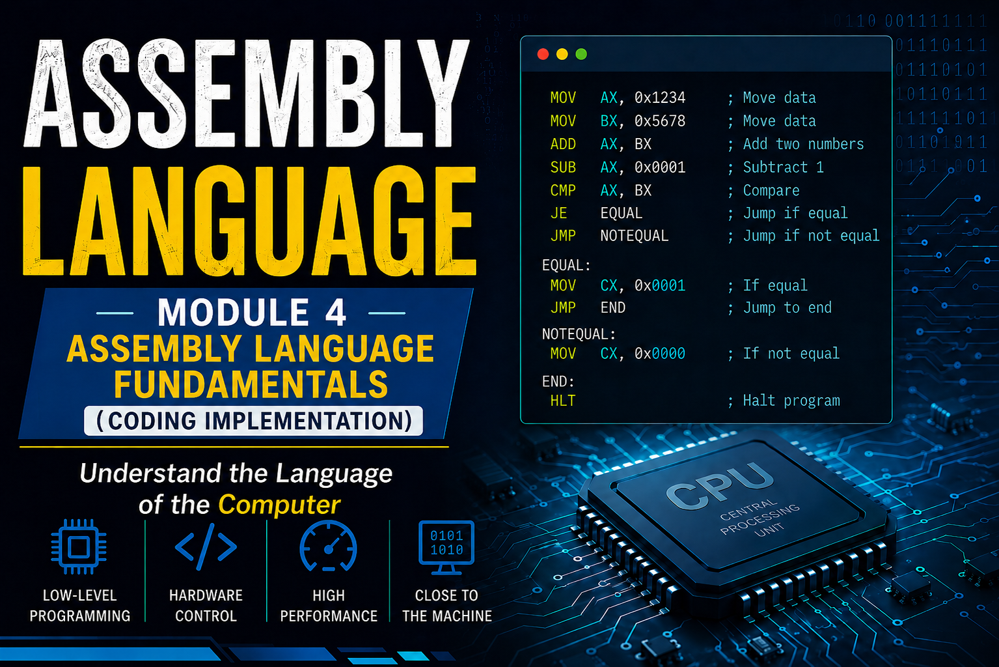

# Module 4: Assembly Language Fundamentals

## 1. Structure of an Assembly Program

Every Assembly language program follows a specific structure. This structure organizes the program into different sections, making it easier to write, understand, and maintain.

### Basic Structure

```assembly
.model small
.stack 100h

.data
    ; Variable declarations

.code
main proc

    ; Instructions

    ; Terminate Program
    mov ah, 4Ch
    int 21h

main endp
end main
```

### Explanation

* **`.model small`** specifies the memory model. The `small` model uses one code segment and one data segment.
* **`.stack 100h`** reserves 256 bytes of memory for the stack.
* **`.data`** section is used to declare variables and constants.
* **`.code`** section contains executable instructions.
* **`main proc`** marks the beginning of the main procedure.
* **`main endp`** marks the end of the procedure.
* **`mov ah, 4Ch`** and **`int 21h`** are used to terminate the program.
* **`end main`** indicates the end of the program.

---

## 2. Comments and Syntax

### Comments

Comments are notes added by programmers to explain the code. They improve readability and help others understand the program. Comments are ignored by the assembler during execution.

In Assembly language, comments start with a semicolon (`;`).

### Example

```assembly
.model small
.stack 100h

.data
    num db 10      ; Variable declaration

.code
main proc

    mov al, num    ; Load value into AL register

    ; Program termination
    mov ah, 4Ch
    int 21h

main endp
end main
```

### Syntax of an Instruction

The general syntax of an Assembly instruction is:

```assembly
Opcode Destination, Source
```

### Example

```assembly
mov ax, bx
```

Here:

* **MOV** → Opcode (operation to perform)
* **AX** → Destination operand
* **BX** → Source operand

Another example:

```assembly
add ax, 5
```

This instruction adds `5` to register `AX`.

---

## 3. Data Types

Data types define the size of data stored in memory. Different data types occupy different amounts of memory.

| Data Type | Size    | Description        |
| --------- | ------- | ------------------ |
| DB        | 1 Byte  | Define Byte        |
| DW        | 2 Bytes | Define Word        |
| DD        | 4 Bytes | Define Double Word |

### Example

```assembly
.data
    age     db 20          ; 1 byte
    marks   dw 850         ; 2 bytes
    salary  dd 50000       ; 4 bytes
```

### Coding Example

```assembly
.model small
.stack 100h

.data
    num1 db 25
    num2 db 15

.code
main proc

    mov al, num1
    add al, num2

    mov ah, 4Ch
    int 21h

main endp
end main
```

In this example:

* `num1` and `num2` are byte variables.
* Their values are loaded and added using the `AL` register.

---

## 4. Variables and Constants

### Variables

Variables are memory locations whose values can change during program execution.

### Example

```assembly
.data
    number db 10
```

The value of `number` can be modified during execution.

### Constants

Constants are fixed values that remain unchanged throughout the program.

### Example

```assembly
.data
    VALUE equ 100
```

`VALUE` always represents `100`.

### Coding Example

```assembly
.model small
.stack 100h

.data
    num db 10

VALUE equ 5

.code
main proc

    mov al, num
    add al, VALUE

    mov ah, 4Ch
    int 21h

main endp
end main
```

### Explanation

* `num` is a variable storing `10`.
* `VALUE` is a constant equal to `5`.
* The program adds the constant to the variable and stores the result in register `AL`.

---

**Practice these concepts with small programs regularly. Consistent practice is the key to mastering Assembly language.**
#### Written by: Nimra Asif
