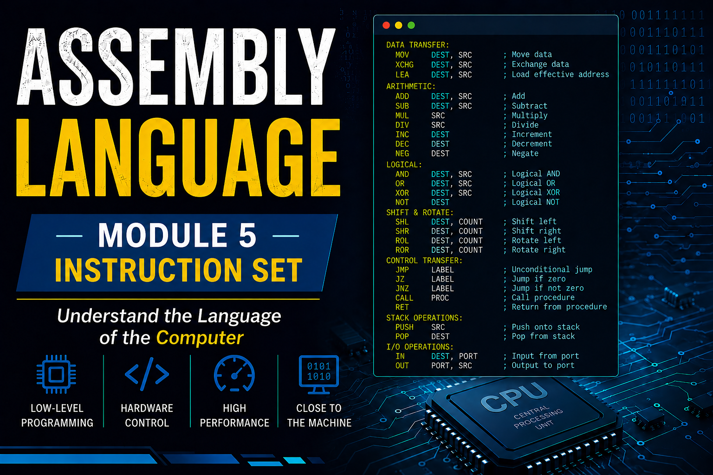

# Module 1: Instruction Set

## 1. MOV Instruction

The **MOV** instruction is one of the most commonly used instructions in Assembly language. It is used to transfer data from one location to another. The data can be moved between registers, memory locations, or immediate values.

### Syntax

```assembly
MOV destination, source
```

### Important Rules

* The source and destination must be of the same size.
* Memory-to-memory data transfer is not allowed directly.
* The source operand remains unchanged after execution.

### Examples

```assembly
mov ax, bx      ; Copy contents of BX into AX
mov al, 10      ; Store immediate value 10 in AL
mov bl, al      ; Copy contents of AL into BL
```

### Coding Example

```assembly
.model small
.stack 100h

.data
    num db 25

.code
main proc

    mov ax, @data
    mov ds, ax

    mov al, num     ; Move value of num into AL
    mov bl, al      ; Copy AL into BL

    ; Terminate program
    mov ah, 4Ch
    int 21h

main endp
end main
```

### Explanation

* `mov ax, @data` loads the address of the data segment into `AX`.
* `mov ds, ax` initializes the data segment register.
* `mov al, num` copies the value stored in `num` into register `AL`.
* `mov bl, al` copies the contents of `AL` into `BL`.

---

## 2. Arithmetic Instructions

Arithmetic instructions are used to perform mathematical operations such as addition, subtraction, multiplication, and division.

### Common Arithmetic Instructions

| Instruction | Purpose                            |
| ----------- | ---------------------------------- |
| `ADD`       | Adds two operands                  |
| `SUB`       | Subtracts one operand from another |
| `INC`       | Increments operand by 1            |
| `DEC`       | Decrements operand by 1            |
| `MUL`       | Performs unsigned multiplication   |
| `DIV`       | Performs unsigned division         |

---

### ADD Instruction

The `ADD` instruction adds the source operand to the destination operand.

#### Syntax

```assembly
ADD destination, source
```

#### Example

```assembly
mov al, 10
add al, 5      ; AL = 15
```

---

### SUB Instruction

The `SUB` instruction subtracts the source operand from the destination operand.

#### Example

```assembly
mov al, 20
sub al, 5      ; AL = 15
```

---

### INC Instruction

The `INC` instruction increases the value of an operand by 1.

#### Example

```assembly
mov al, 10
inc al         ; AL = 11
```

---

### DEC Instruction

The `DEC` instruction decreases the value of an operand by 1.

#### Example

```assembly
mov al, 10
dec al         ; AL = 9
```

---

### MUL Instruction

The `MUL` instruction multiplies two unsigned numbers.

#### Example

```assembly
mov al, 5
mov bl, 2
mul bl         ; AX = AL × BL = 10
```

---

### DIV Instruction

The `DIV` instruction divides an unsigned number.

#### Example

```assembly
mov ax, 20
mov bl, 5
div bl         ; AL = Quotient (4), AH = Remainder (0)
```

---

## Complete Program Example

```assembly
.model small
.stack 100h

.data

.code
main proc

    mov ax, @data
    mov ds, ax

    mov al, 10
    add al, 5      ; AL = 15

    sub al, 3      ; AL = 12

    inc al         ; AL = 13

    dec al         ; AL = 12

    mov bl, 2
    mul bl         ; AX = 24

    ; Terminate program
    mov ah, 4Ch
    int 21h

main endp
end main
```

This program demonstrates the use of `MOV`, `ADD`, `SUB`, `INC`, `DEC`, and `MUL` instructions.

**Keep practicing these instructions regularly, as they form the foundation of Assembly language programming.**
