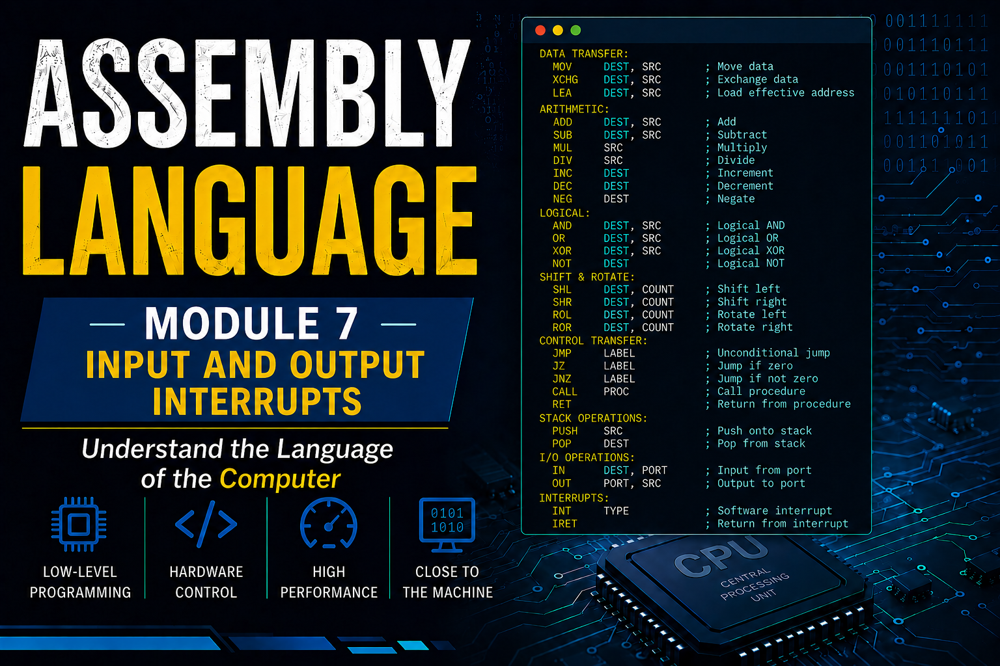

# Module 7: Input and Output

Input and Output (I/O) operations allow a program to communicate with the user and external devices. In Assembly language, I/O operations are commonly performed using **interrupts**. The **8086 microprocessor** mainly uses **DOS** and **BIOS interrupts** for handling input and output operations.

---

# 1. Console Input

Console input refers to receiving data from the keyboard. In Assembly language, keyboard input is usually performed using **DOS Interrupt 21h**.

## Single Character Input

To take a single character from the keyboard, we use **Function 01h** of Interrupt `21h`.

### Syntax

```assembly id="uk3h5u"
mov ah, 01h
int 21h
```

### Explanation

* `mov ah, 01h` selects the keyboard input function.
* `int 21h` waits for the user to press a key.
* The entered character is automatically stored in register **AL**.

### Example

```assembly id="h5os0m"
.model small
.stack 100h

.code
main proc

    ; Take input from user
    mov ah, 01h
    int 21h

    ; Terminate program
    mov ah, 4Ch
    int 21h

main endp
end main
```

---

# 2. Console Output

Console output refers to displaying information on the screen.

## Displaying a Single Character

To display a single character, we use **Function 02h** of Interrupt `21h`.

### Syntax

```assembly id="6xij7t"
mov ah, 02h
mov dl, character
int 21h
```

### Example

```assembly id="x6b34f"
.model small
.stack 100h

.code
main proc

    mov dl, 'A'
    mov ah, 02h
    int 21h

    ; Terminate program
    mov ah, 4Ch
    int 21h

main endp
end main
```

### Output

```text id="tlv4ny"
A
```

---

## Displaying a String

To display a string, we use **Function 09h** of Interrupt `21h`.

### Syntax

```assembly id="g28ynz"
mov ah, 09h
lea dx, string_name
int 21h
```

### Example

```assembly id="8ct92s"
.model small
.stack 100h

.data
    msg db 'Hello World!$'

.code
main proc

    mov ax, @data
    mov ds, ax

    mov ah, 09h
    lea dx, msg
    int 21h

    mov ah, 4Ch
    int 21h

main endp
end main
```

### Output

```text id="t5m4am"
Hello World!
```

---

# 3. Interrupts: DOS and BIOS

An **Interrupt** is a signal that temporarily stops the execution of the current program and transfers control to a special routine to perform a specific task.

Interrupts make programming easier because they provide ready-made services for input, output, screen handling, keyboard operations, and many other tasks.

---

## DOS Interrupts

DOS interrupts provide services related to the operating system.

The most commonly used DOS interrupt is:

```assembly id="zrzgoh"
INT 21h
```

### Common DOS Functions

| AH Value | Function                       |
| -------- | ------------------------------ |
| 01h      | Read a character from keyboard |
| 02h      | Display a character            |
| 09h      | Display a string               |
| 4Ch      | Terminate program              |

### Example

```assembly id="vho5zr"
mov ah, 09h
lea dx, msg
int 21h
```

This instruction displays a string on the screen.

---

## BIOS Interrupts

BIOS interrupts directly communicate with hardware devices such as the keyboard, screen, disk drives, and printer.

A commonly used BIOS interrupt is:

```assembly id="j0b9is"
INT 10h
```

which is used for video and screen operations.

### Example: Change Screen Mode

```assembly id="utxfu0"
mov ah, 00h
mov al, 03h
int 10h
```

This program sets the display to the standard text mode.

---

Another commonly used BIOS interrupt is:

```assembly id="7x80md"
INT 16h
```

which is used for keyboard operations.

### Example: Read a Key from Keyboard

```assembly id="cg7z2n"
mov ah, 00h
int 16h
```

The pressed key is returned in register **AL**.

---

## Difference Between DOS and BIOS Interrupts

| DOS Interrupts                           | BIOS Interrupts                              |
| ---------------------------------------- | -------------------------------------------- |
| Operate through the DOS operating system | Directly access hardware                     |
| Slower compared to BIOS                  | Faster because they access hardware directly |
| More user-friendly                       | More hardware-oriented                       |
| Example: `INT 21h`                       | Example: `INT 10h`, `INT 16h`                |

---

## Complete Example: Input and Output

```assembly id="0a65m3"
.model small
.stack 100h

.data
    msg db 'Enter a character: $'

.code
main proc

    mov ax, @data
    mov ds, ax

    ; Display message
    mov ah, 09h
    lea dx, msg
    int 21h

    ; Take input
    mov ah, 01h
    int 21h

    ; Display entered character
    mov dl, al
    mov ah, 02h
    int 21h

    ; Terminate program
    mov ah, 4Ch
    int 21h

main endp
end main
```

### Output

```text id="r6g4b9"
Enter a character: A
A
```

**Input and Output operations are fundamental concepts in Assembly language because almost every program interacts with users through the keyboard and screen. Practice these programs regularly to strengthen your understanding of DOS and BIOS interrupts.**
