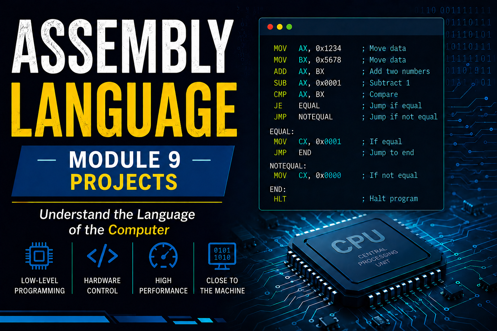

# Multi-Function Calculator in Assembly Language (EMU8086)

## Project Description

This project implements a **Multi-Function Calculator** in Assembly Language using **EMU8086**. The calculator accepts **two multi-digit numbers** from the user and performs the following operations:

* Addition (`+`)
* Subtraction (`-`)
* Multiplication (`*`)
* Division (`/`)

The project demonstrates the concept of **ASCII-to-Integer Conversion**, which is essential when taking numeric input from the keyboard because keyboard input is received in ASCII format.

---

## Learning Objectives

After completing this project, students will be able to:

* Take multi-digit input from the user.
* Convert ASCII characters into integers.
* Perform arithmetic operations in Assembly Language.
* Display numeric results on the screen.
* Understand DOS Interrupt `21h` functions.

---

## Algorithm

### Step 1: Input First Number

* Read characters one by one.
* Convert ASCII digit to integer by:

```text id="vcikyr"
Integer = ASCII - 48
```

* Build the complete number:

```text id="5m9lyl"
Number = Number * 10 + Digit
```

---

### Step 2: Input Second Number

Repeat the same process.

---

### Step 3: Ask User for Operation

User enters:

```text id="wblm4q"
+  Addition
-  Subtraction
*  Multiplication
/  Division
```

---

### Step 4: Perform Operation

Use conditional jumps:

```text id="4e0m0s"
CMP AL,'+'
JE ADDITION

CMP AL,'-'
JE SUBTRACTION

CMP AL,'*'
JE MULTIPLICATION

CMP AL,'/'
JE DIVISION
```

---

## EMU8086 Code

```assembly
.model small
.stack 100h

.data
    msg1 db 13,10,'Enter First Number: $'
    msg2 db 13,10,'Enter Second Number: $'
    msg3 db 13,10,'Enter Operator (+,-,*,/): $'
    resultMsg db 13,10,'Result = $'

    num1 dw ?
    num2 dw ?
    result dw ?
    op db ?

.code
main proc

    mov ax,@data
    mov ds,ax

;================ FIRST NUMBER ================

    lea dx,msg1
    mov ah,09h
    int 21h

    call ReadNumber
    mov num1,ax

;================ SECOND NUMBER ================

    lea dx,msg2
    mov ah,09h
    int 21h

    call ReadNumber
    mov num2,ax

;================ OPERATOR =====================

    lea dx,msg3
    mov ah,09h
    int 21h

    mov ah,01h
    int 21h
    mov op,al

;================ OPERATIONS ===================

    mov al,op

    cmp al,'+'
    je Addition

    cmp al,'-'
    je Subtraction

    cmp al,'*'
    je Multiplication

    cmp al,'/'
    je Division

Addition:
    mov ax,num1
    add ax,num2
    mov result,ax
    jmp Display

Subtraction:
    mov ax,num1
    sub ax,num2
    mov result,ax
    jmp Display

Multiplication:
    mov ax,num1
    mov bx,num2
    mul bx
    mov result,ax
    jmp Display

Division:
    mov ax,num1
    mov bx,num2
    xor dx,dx
    div bx
    mov result,ax

Display:
    lea dx,resultMsg
    mov ah,09h
    int 21h

    mov ax,result
    call PrintNumber

    mov ah,4Ch
    int 21h

main endp

;==============================================
; PROCEDURE TO READ MULTI-DIGIT NUMBER
;==============================================

ReadNumber proc

    xor bx,bx

ReadLoop:
    mov ah,01h
    int 21h

    cmp al,13
    je EndRead

    sub al,48

    mov ah,0
    mov cx,ax

    mov ax,bx
    mov dx,10
    mul dx

    add ax,cx
    mov bx,ax

    jmp ReadLoop

EndRead:
    mov ax,bx
    ret

ReadNumber endp

;==============================================
; PROCEDURE TO PRINT NUMBER
;==============================================

PrintNumber proc

    mov bx,10
    xor cx,cx

Convert:
    xor dx,dx
    div bx
    push dx
    inc cx

    cmp ax,0
    jne Convert

Print:
    pop dx
    add dl,48

    mov ah,02h
    int 21h

    loop Print

    ret

PrintNumber endp

end main
```

## Sample Run

```text id="4qq7xh"
Enter First Number: 25
Enter Second Number: 5
Enter Operator (+,-,*,/): *

Result = 125
```

This mini-project teaches one of the most important Assembly concepts: **ASCII-to-Integer conversion**, which is frequently used in real-world applications.
