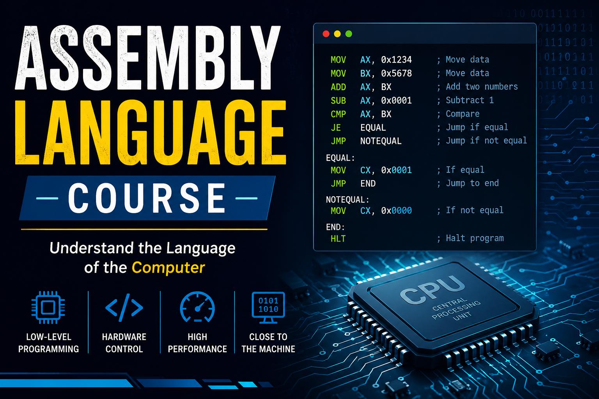

# Assembly Language Course Roadmap

## Module 1: Introduction to Assembly Language

* What is Assembly Language?
* High-Level vs Low-Level Languages
* History of Assembly Language
* Applications of Assembly Language

## Module 2: Computer Architecture Basics

* CPU Architecture
* Registers
* Memory Organization
* Data Bus, Address Bus, and Control Bus

## Module 3: Number Systems

* Binary Number System
* Decimal Number System
* Octal Number System
* Hexadecimal Number System
* Number System Conversions

## Module 4: Assembly Language Fundamentals

* Structure of an Assembly Program
* Comments and Syntax
* Data Types
* Variables and Constants

## Module 5: Instructions Set

* Mov Instructions
* Arithmetic Instructions

## Module 6: Control Flow
* Cmp Instructions
* Jump Instructions
* Conditional Statements and Unconditional statements
* Flags Register

## Module 9: Input and Output

* Console Input
* Console Output
* Interrupts

## Module 10: Advanced Concepts

* Memory Addressing Modes
  
## Module 11: Practical Projects
* Mini Projects

# 💡 Stay focused, practice consistently, and keep exploring low-level programming. Consistency is the key to mastering Assembly Language. 
